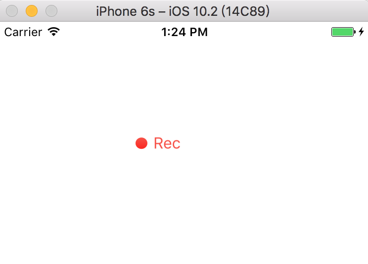
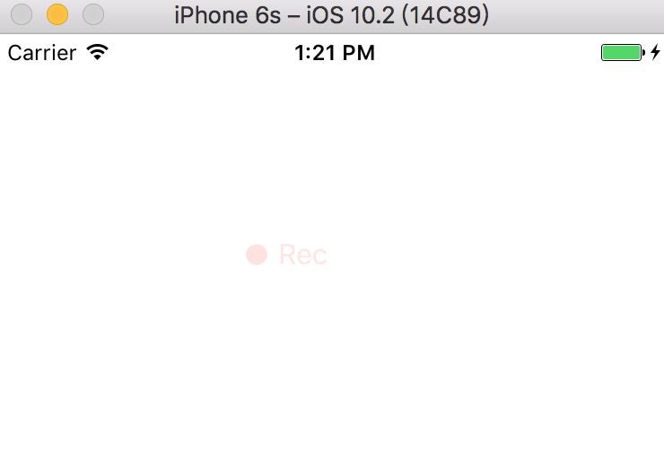

# BlinkView

一个自定义的 UIView，显示一个会不停闪烁的图标和文字效果：




## 用法：

### 方法

提供两个方法：

1. 开始闪烁 animating
2. 停止闪烁 stopAnimating

示例：

```swift
- (IBAction)action:(id)sender {
    if(_blinkView.stopped){
        [_blinkView animating];
    }else{
        [_blinkView stopAnimating];
    }
}
```

### 属性

* UIImage* image 和 UIImage* altImage：前面的小图标会在 image 和 altImage 之间来回切换图片
* CGRect imageRect：图标所在位置及大小
* CGFloat gapWidth：图文之间的间隔
* CGFloat fontSize：文字大小
* NSString* text：文字内容
* UIColor* textColor 和 UIColor* altTextColor：文字颜色会在 textColor 和 altTextColor 之间来回切换
* BOOL stopped：表示动画是否停止
* double updateInterval：更新动画间隔时间


